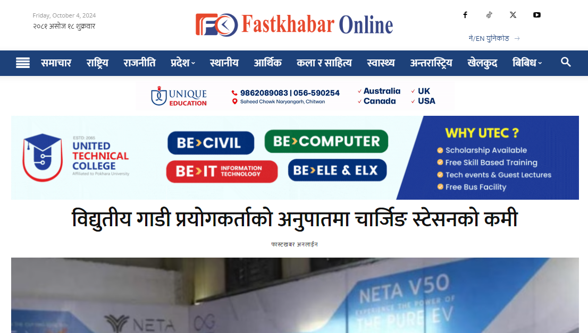

# Fastkhabar Online - Nepali News Website

Fastkhabar Online is a fully functional Nepali news website developed using WordPress. The website offers key sections like home, stocks, and more, providing a seamless experience for users seeking real-time news and updates in the Nepali language.

## Project Overview
- **Project Name:** Fastkhabar Online
- **Client:** Nabin Subedi
- **Completion Time:** 35 days
- **Technology:** WordPress, Custom Theme (pradipsub), Custom Plugins, Deep WordPress Theme Modifications

## Key Features
- **Home Page:** A dynamic homepage displaying the latest news and trending stories.
- **Stocks Section:** A dedicated section for live stock market updates.
- **Custom Theme (pradipsub):** The website uses a unique custom-built WordPress theme for enhanced performance and flexibility.
- **Custom Plugins:** Additional functionalities built through custom plugins tailored to the website’s needs.
- **Responsive Design:** Ensures the site is fully optimized for all device types.
- **SEO Optimized:** The site is fine-tuned to perform well in search engine rankings.

## Preview
Below is a preview of the [fastkhabaronline.com](https://fastkhabaronline.com) website:

## License
This project is for the exclusive use of Nabin Subedi and his team. Any redistribution or replication without permission is prohibited.

## Contact
For any queries or support, feel free to contact the developer:
- **Name:** Pradip Subedi
- **Email:** sprasapradip@gmail.com
- **Website:** [pradipsubedi1.com.np](https://pradipsubedi1.com.np)
- **GitHub:** [sprasapradip](https://github.com/sprasapradip)
- **Phone:** +977 9843944252 / +977 9805151362

*For project-related inquiries, or to discuss building a similar website, contact me directly via email or phone.*
